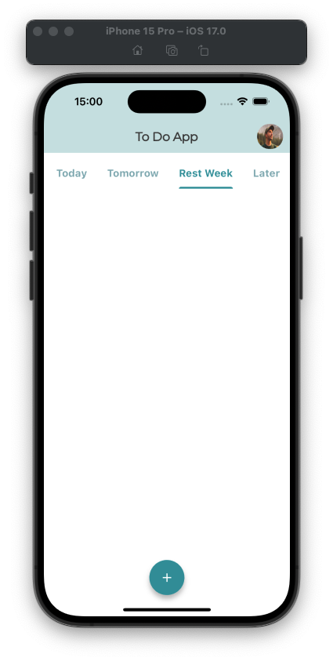
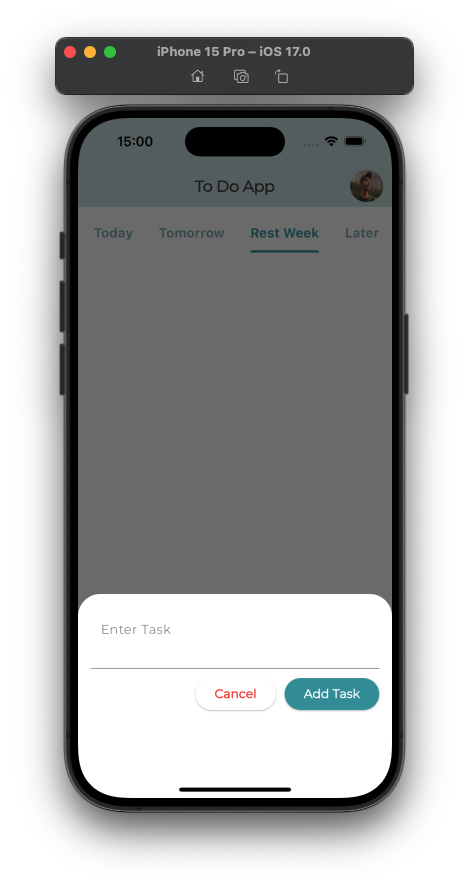
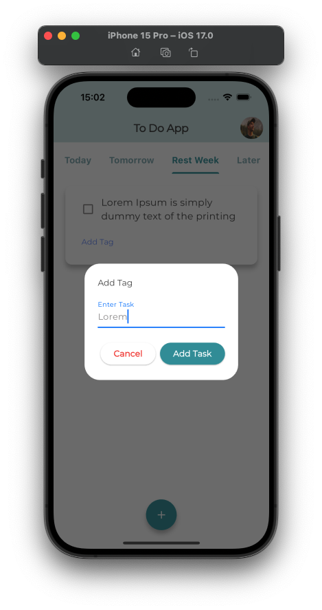
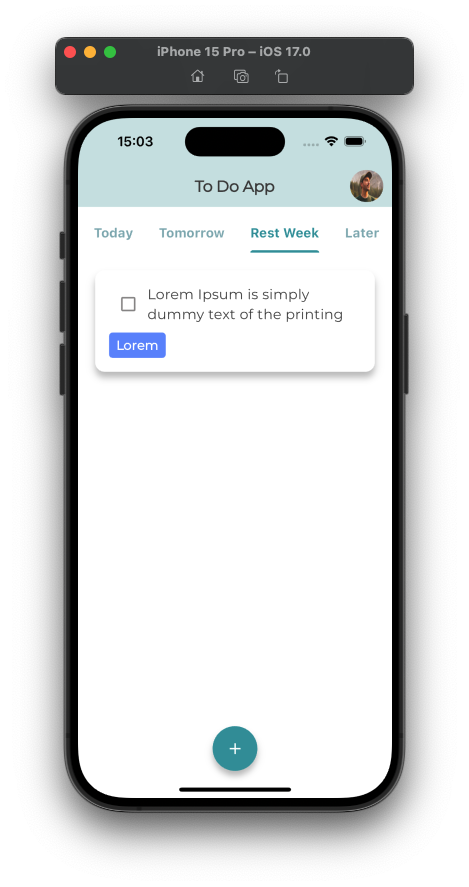
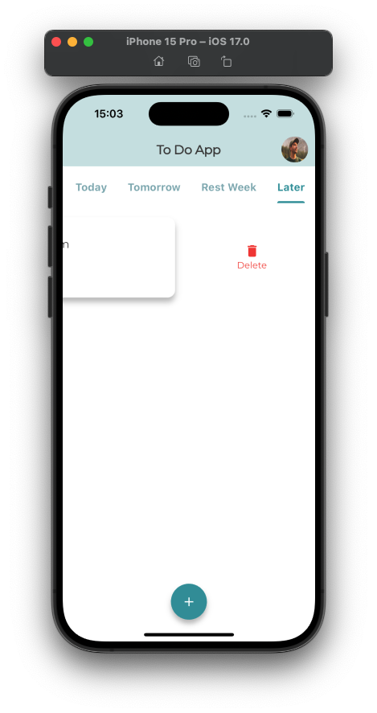
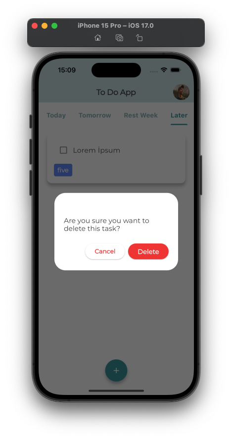

# Todo App

This application provides a simple and user-friendly interface for users to manage their daily tasks. It allows users to add, mark as complete, and delete tasks with ease.

## Packages Used

### flutter_screenutil: ^5.9.0
A Flutter plugin for adapting screen and font size.

### google_fonts: ^6.2.0
A Flutter package to use fonts from fonts.google.com.

### provider: ^6.1.2
A wrapper around InheritedWidget to make them easier to use and more reusable.

### intl: ^0.19.0
Contains code to deal with internationalized/localized messages, date and number formatting and parsing, bi-directional text, and other internationalization issues.

### flutter_slidable: ^3.1.1
A Flutter implementation of slidable list item with directional slide actions that can be dismissed.

## Screenshots









## Installation

Clone the repository to your local development environment and install dependencies by following these steps:

```bash
git clone https://github.com/user/application.git
cd application/
flutter pub get
flutter run
